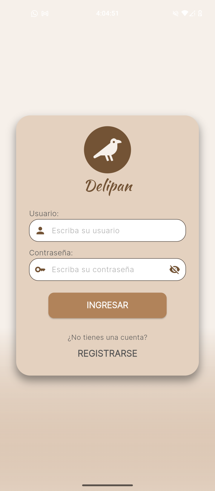
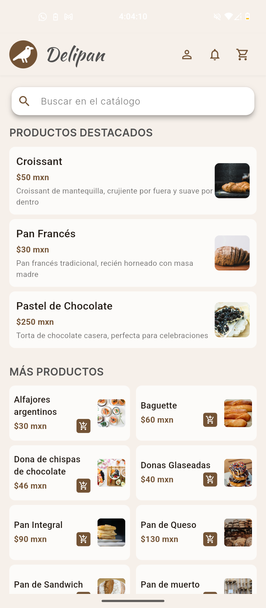
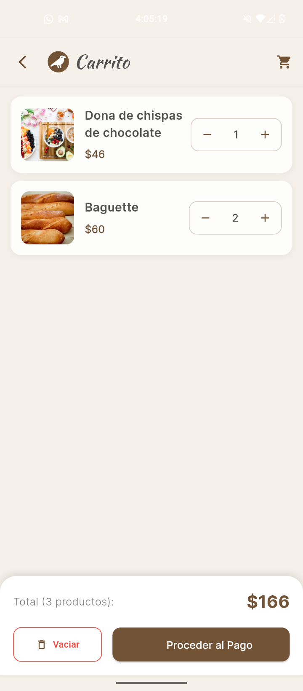
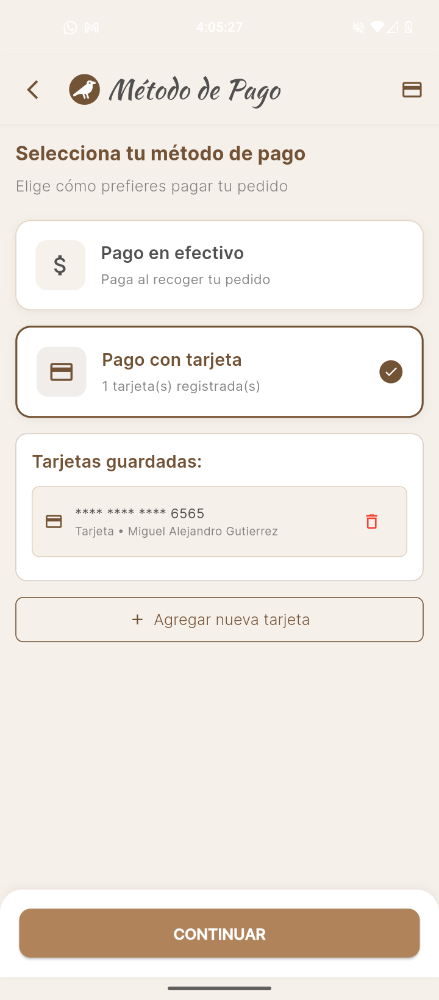
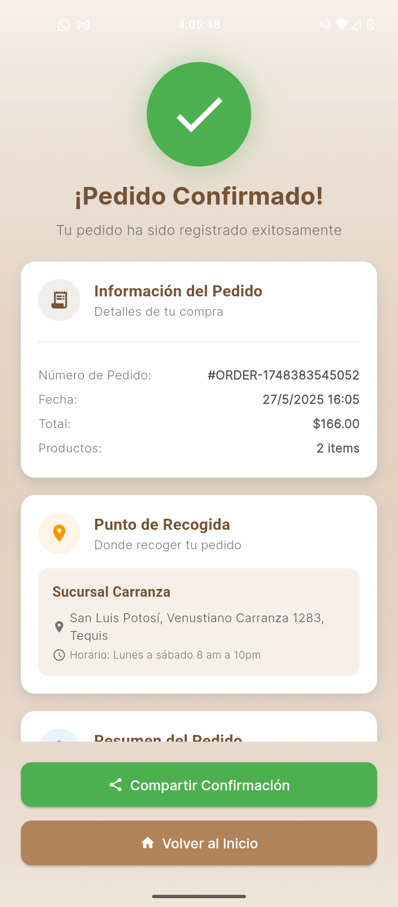
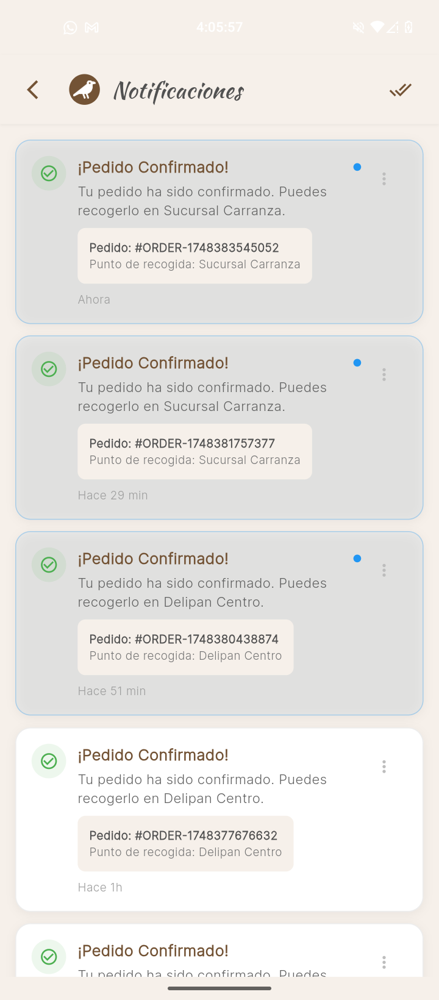
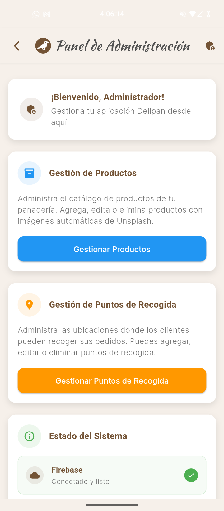

# Delipan

Aplicación móvil desarrollada como proyecto educativo para la materia **Fundamentos de Desarrollo Móvil**.

## 📚 Documentación

- **📖 [Manual de Usuario](doc/ManualUsuario.pdf)** - Guía básica de uso de la aplicación
- **🎨 [Mockups](doc/Mockups%20delipan.pdf)** - Maquetado inicial del proyecto (Figma).

## Información Académica

- **Materia:** 223902 - Fundamentos de Desarrollo Móvil
- **Profesor:** Ing. Ordaz Narváez Oscar Alejandro
- **Fecha de Entrega:** 27/05/2025

## Autores

- **Carlos André Ramírez Acosta**
- **Miguel Alejandro Gutiérrez Silva**

## Descripción del Proyecto

Delipan es una aplicación móvil desarrollada en Flutter como parte del proyecto final de la materia FDM. Es una aplicación de panadería que permite a los usuarios explorar productos, gestionar un carrito de compras, seleccionar puntos de recogida y realizar pedidos. La aplicación incluye funcionalidades de autenticación, gestión de roles (usuario/administrador) y sincronización en tiempo real con Firebase.

## 📱 Capturas de Pantalla

### Pantallas de Usuario

<div align="center">

| Inicio de Sesión | Pantalla Principal | Carrito de Compras |
|:----------------:|:------------------:|:------------------:|
|  |  |  |

| Mapa de Puntos | Proceso de Pago | Confirmación |
|:--------------:|:---------------:|:------------:|
|  |  |  |

| Notificaciones | Panel de Admin |
|:--------------:|:--------------:|
|  |  |

</div>

## Estructura del Proyecto

```
delipan/
├── lib/
│   ├── main.dart                    # Punto de entrada de la aplicación
│   ├── config/                      # Configuraciones globales
│   │   └── styles.dart             # Estilos y temas de la aplicación
│   ├── features/                    # Características principales por módulos
│   │   ├── auth/                   # Autenticación (login, registro)
│   │   ├── home/                   # Pantalla principal y navegación
│   │   ├── admin/                  # Panel de administración
│   │   └── cart/                   # Carrito de compras y checkout
│   ├── models/                      # Modelos de datos
│   │   ├── product.dart            # Modelo de productos
│   │   ├── pickup_point.dart       # Modelo de puntos de recogida
│   │   ├── firebase_cart.dart      # Modelo del carrito
│   │   └── firebase_cart_item.dart # Items del carrito
│   ├── services/                    # Servicios y lógica de negocio
│   │   ├── product_service.dart    # Gestión de productos
│   │   ├── pickup_service.dart     # Gestión de puntos de recogida
│   │   ├── user_service.dart       # Gestión de usuarios
│   │   ├── card_service.dart       # Gestión de tarjetas de pago
│   │   └── firebase_cart_service.dart # Servicio del carrito
│   ├── utils/                       # Utilidades y helpers
│   │   └── auth_services.dart      # Servicios de autenticación
│   └── firebase_options.dart       # Configuración de Firebase
├── assets/
│   ├── images/                      # Imágenes y recursos gráficos
│   │   └── Logo_delipan.png        # Logo de la aplicación
│   └── fonts/                       # Fuentes personalizadas
├── android/                         # Configuración específica de Android
├── ios/                            # Configuración específica de iOS
├── pubspec.yaml                    # Dependencias y configuración del proyecto
└── README.md                       # Este archivo
```

## Tecnologías Utilizadas

- **Flutter:** Framework de desarrollo multiplataforma (versión estable)
- **Dart:** Lenguaje de programación principal
- **Firebase:** Backend as a Service para:
  - **Firebase Auth:** Autenticación de usuarios
  - **Cloud Firestore:** Base de datos NoSQL en tiempo real
  - **Firebase Storage:** Almacenamiento de archivos
- **Material Design:** Sistema de diseño de Google
- **OpenStreetMap:** Mapas y geocodificación

## Dependencias Principales

Las principales dependencias se encuentran en `pubspec.yaml`:

```yaml
dependencies:
  flutter: 
    sdk: flutter
  cupertino_icons: ^1.0.8
  firebase_core: ^3.8.0
  firebase_auth: ^5.3.3
  cloud_firestore: ^5.5.0
  provider: ^6.1.2
  page_transition: ^2.1.0
  flutter_credit_card: ^4.0.1
  flutter_map: ^7.0.2
  latlong2: ^0.9.1
  http: ^1.2.2
```

## Funcionalidades Principales

### Para Usuarios:
- **Autenticación:** Registro e inicio de sesión seguro
- **Catálogo de Productos:** Exploración de productos de panadería
- **Carrito de Compras:** Gestión de productos sincronizada en tiempo real
- **Búsqueda:** Sistema de búsqueda de productos
- **Métodos de Pago:** Gestión de tarjetas de crédito y pago en efectivo
- **Puntos de Recogida:** Selección de ubicaciones para recoger pedidos
- **Vista de Mapa:** Visualización de puntos de recogida en mapa interactivo

### Para Administradores:
- **Panel de Administración:** Gestión completa del sistema
- **Gestión de Productos:** CRUD completo de productos con imágenes automáticas
- **Gestión de Puntos de Recogida:** Administración de ubicaciones con geocodificación

## Características Técnicas

- **Arquitectura Modular:** Organización por características (features)
- **Estado Reactivo:** Uso de Provider para gestión de estado
- **Sincronización en Tiempo Real:** Firebase Firestore para datos actualizados
- **Interfaz Responsive:** Diseño adaptable a diferentes tamaños de pantalla
- **Navegación Fluida:** Transiciones suaves entre pantallas
- **Validación de Formularios:** Validación en tiempo real de datos de entrada
- **Persistencia de Datos:** Carrito y preferencias sincronizadas en la nube
- **Geocodificación:** Conversión automática de direcciones a coordenadas
- **Imágenes Dinámicas:** Integración con Unsplash para imágenes de productos

## Instalación y Configuración

### Prerrequisitos

- Flutter SDK (versión 3.0 o superior)
- Dart SDK
- Android Studio / Visual Studio Code
- Dispositivo Android/iOS o emulador
- Cuenta de Firebase (para configuración del backend)

### Pasos de Instalación

1. **Clonar el repositorio:**
   ```bash
   git clone [URL_DEL_REPOSITORIO]
   cd delipan
   ```

2. **Instalar dependencias:**
   ```bash
   flutter pub get
   ```

3. **Configurar Firebase:**
   - Crear un proyecto en [Firebase Console](https://console.firebase.google.com/)
   - Configurar Authentication (Email/Password)
   - Crear base de datos Firestore
   - Descargar y configurar los archivos de configuración

4. **Ejecutar la aplicación:**
   ```bash
   flutter run
   ```

### Configuración de Firebase

1. **Authentication:** Habilitar Email/Password
2. **Firestore Database:** Crear las siguientes colecciones:
   - `productos` - Para productos de la panadería
   - `usuarios` - Para información de usuarios
   - `pickup_points` - Para puntos de recogida
   - `users/{userId}/cart` - Para carritos de usuarios

3. **Reglas de Firestore:**
   ```javascript
   rules_version = '2';
   service cloud.firestore {
     match /databases/{database}/documents {
       match /{document=**} {
         allow read, write: if request.auth != null;
       }
     }
   }
   ```

## Pantallas Principales
- **Splash Screen:** Pantalla de carga con logo de Delipan
- **Login/Registro:** Interfaz de autenticación con validación
- **Pantalla Principal:** Catálogo de productos con búsqueda
- **Detalle de Producto:** Información completa con opción de agregar al carrito
- **Carrito:** Gestión de productos con actualización de cantidades
- **Métodos de Pago:** Selección entre efectivo y tarjetas guardadas
- **Puntos de Recogida:** Lista y mapa de ubicaciones disponibles
- **Panel de Administración:** Gestión completa para administradores

## Arquitectura del Proyecto

### Patrón de Arquitectura
- **Separación de Responsabilidades:** División clara entre UI, lógica de negocio y datos
- **Provider Pattern:** Para gestión de estado reactivo
- **Repository Pattern:** Abstracción del acceso a datos
- **Service Layer:** Servicios especializados para cada funcionalidad

### Gestión de Estado
- **Provider:** Para estado global (carrito, autenticación)
- **StatefulWidget:** Para estado local de componentes
- **StreamBuilder:** Para datos en tiempo real de Firebase

## Licencia

Este proyecto es únicamente para fines educativos como parte de la materia Fundamentos de Desarrollo Móvil.

---

**Delipan** - Proyecto educativo FDM 2025
